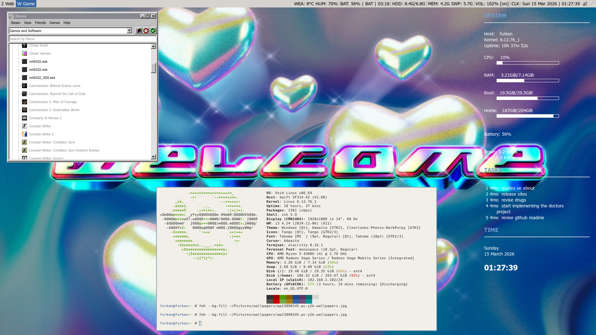
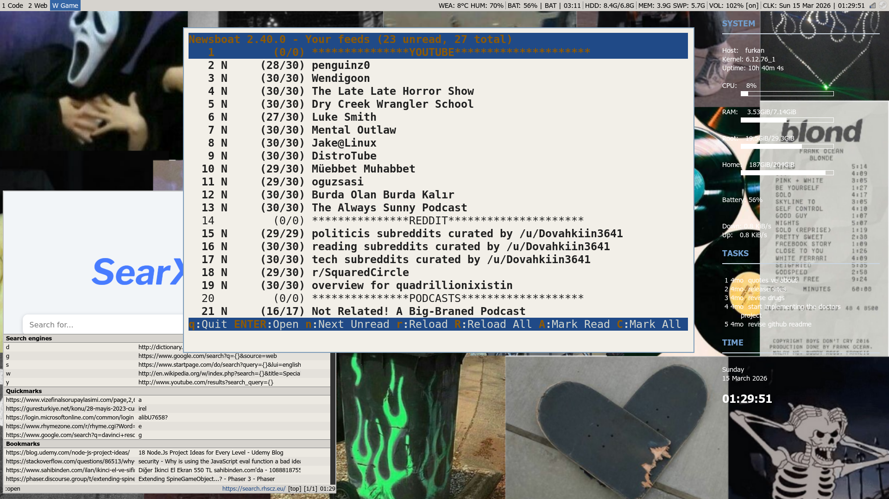
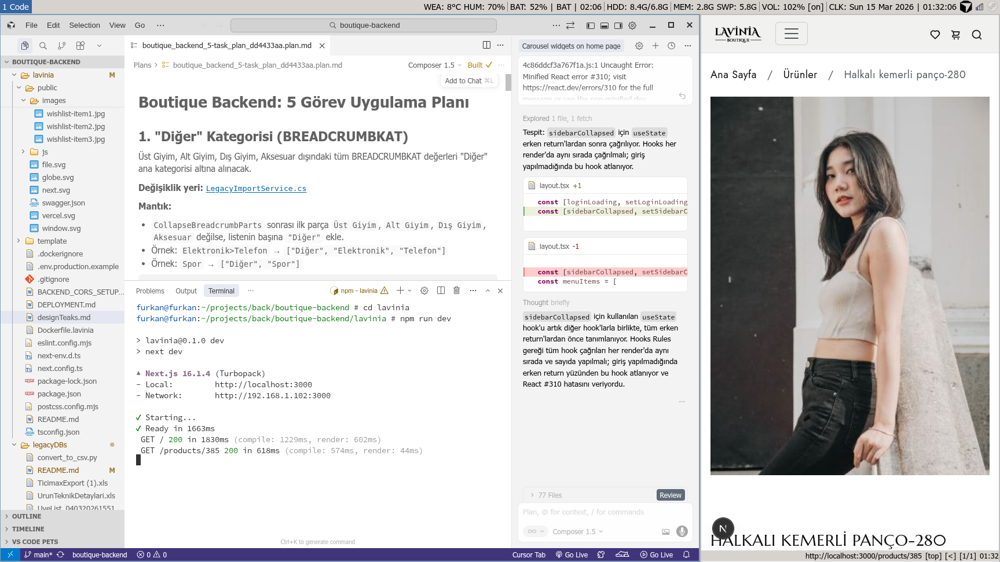
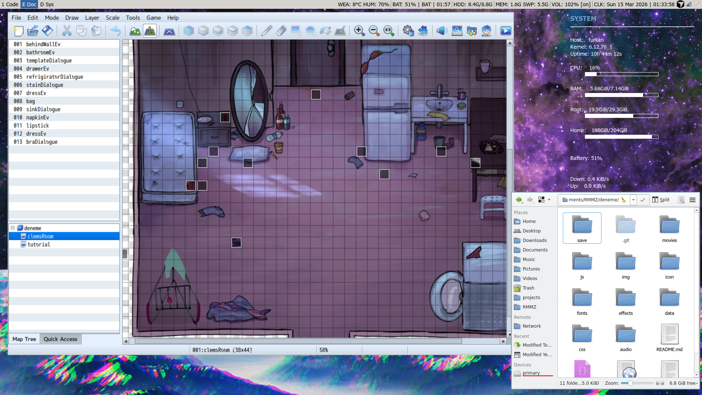
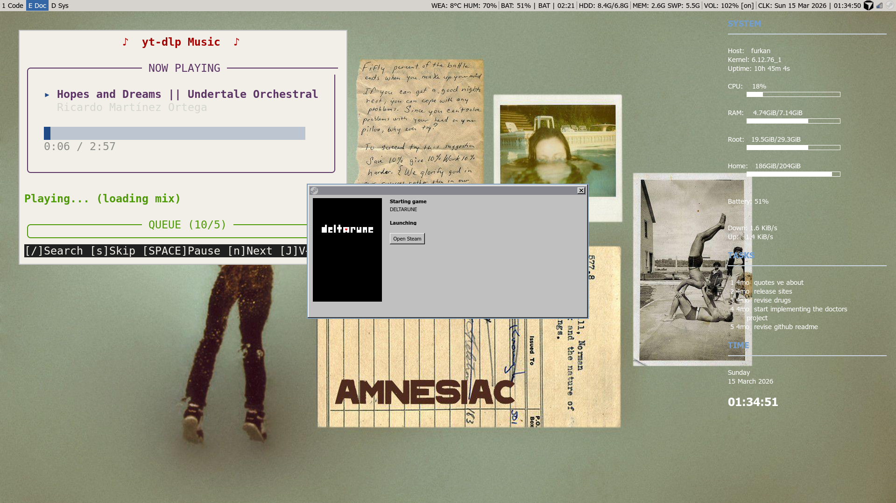
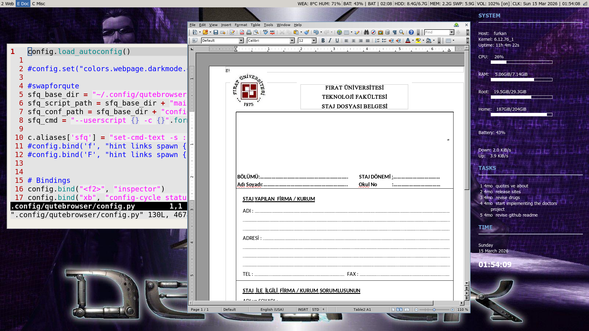
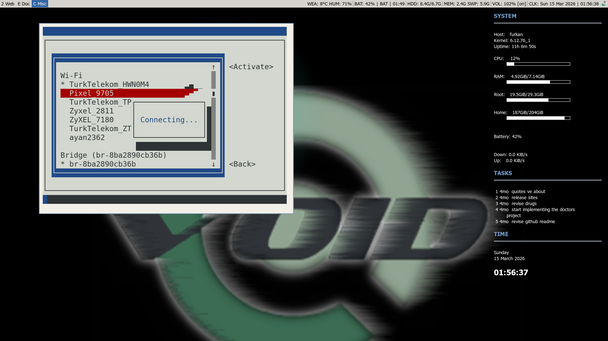

# Retro Linux i3 Rice

A lightweight **early-2000s inspired Linux desktop setup** built on top of **i3**.  
The goal of this configuration is a clean, keyboard-driven environment with a nostalgic Linux aesthetic while still keeping modern usability.

This setup focuses on simplicity, minimal dependencies, and classic Unix tools.

---

## Screenshots

---

## Components

| Component | Tool |
|-----------|------|
| **Window Manager** | i3 |
| **Bar** | i3bar + i3blocks |
| **Compositor** | picom |
| **Notifications** | dunst |
| **Launcher** | dmenu |
| **Terminal** | Alacritty |
| **Browser** | qutebrowser |
| **File Manager** | Dolphin |
| **Media Player** | mpv |
| **System Monitor** | Conky |
| **Task Manager** | Taskwarrior (displayed in Conky) |
| **Color Temperature** | redshift |
| **Shell** | zsh |

---

## Themes

| Type | Theme |
|-----|------|
| **GTK Theme** | Adwaita |
| **Qt Style** | qt5ct |
| **Icon Theme** | Tango |
| **Fonts** | Sans / Source Code Pro |

---

## Repository Structure

bashScripts/ helper scripts used in the setup
dunst/ notification daemon configuration
i3/ i3 window manager configuration
i3blocks/ status bar modules
mpv/ mpv media player configuration
qutebrowser/ browser configuration
redshift/ screen temperature configuration
wallpapers/ current wallpapers
wallpapersLegacy/ older wallpapers
screenshots/ desktop screenshots
picom.conf compositor configuration

---

## Installation

Clone the repository:

git clone https://github.com/yourusername/configs.git

Copy configuration files to your home directory:

cp -r configs/* ~/.config/

Some scripts and paths may need adjustment depending on your system.

---

## Environment

This setup was created on:

- **Void Linux**
- **i3 Window Manager**

It should work on most Linux distributions with minimal adjustments.

---

## Inspiration

The setup takes inspiration from classic Linux desktops from the **GNOME 2 / early Arch Linux era**, focusing on lightweight tools and keyboard-driven workflows rather than full desktop environments.

---

## License

Feel free to use, modify, and adapt these configurations.
